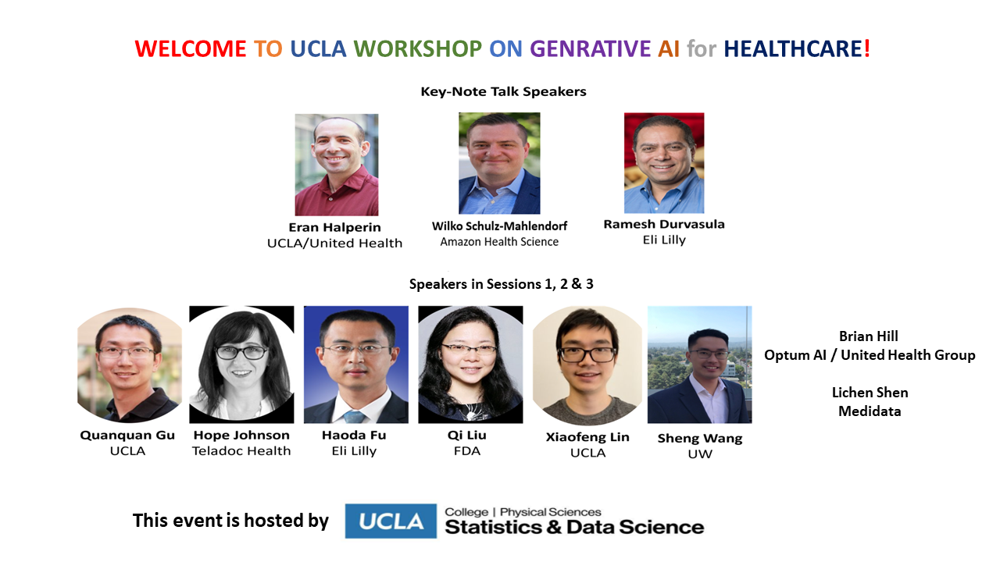

# Generative AI for Healthcare Workshop

We are pleased to announce the Generative AI for Healthcare Workshop at UCLA on April 19th, 2024. This one-day and in-person workshop is hosted by [UCLA Department of Statistics and Data Science](http://statistics.ucla.edu/) and sponsored by [UCLA College Luskin Lecture](https://www.college.ucla.edu/luskinthoughtlecture/about-the-luskin-lecture/), [Science Hub for Humanity and Artificial Intelligence](https://www.sciencehub.ucla.edu/), and [UCLA DataX](https://datax.ucla.edu/). It will be held in the Legacy Room (2nd floor) at the [UCLA Luskin hotel Conference Hotel](https://luskinconferencecenter.ucla.edu/hotels-near-ucla/).

 

### About

Generative AI holds profound significance for healthcare by revolutionizing various aspects of medical research, diagnostics, and patient care. Its capacity to generate realistic and diverse data allows for the creation of synthetic datasets that augment the limited availability of real-world patient information, facilitating the development and validation of robust machine learning models. In this workshop, we will discuss two main pillars in healthcare AI: “trustworthiness” and “interpretability”. In the realm of healthcare, where data privacy and ethical considerations are paramount, the generation of synthetic electronic health records (EHRs) not only enhances trustworthiness by preserving individual privacy but also underscores the critical role of interpretability in ensuring transparent decision-making processes, particularly within medical applications. The workshop brings together a diverse community of generative AI researchers from various disciplines, including statistics, machine learning, and computer science, along with policymakers and industrial partners. Please join us on April 19 for this great event in the Luskin Hotel. Registration is required but free. 

<!--
Synthetic data generation is a rapidly growing and highly interdisciplinary area that
draws much attention from both academia and industry. For the development of algorithmic
procedures for fraud detection and spam identification, as well as for the construction of AI-driven
models in industries like manufacturing and supply chain management, synthetic data
has become a valuable resource. The advantages of synthetic data include cost savings, increased
speed, agility, increased intelligence, and cutting-edge privacy. According to the Gartner report,
synthetic data will overshadow real data in training machine/deep learning models by 2030; see
Figure below. Additionally, the [MIT Technology Review](https://www.technologyreview.com/2022/02/23/1045416/10-breakthrough-technologies-2022/#synthetic-data-for-ai) named synthetic data as one of its top 10 game-changing innovations for 2022. Synthetic data is everywhere: image, text, graph and tabular data; it has different names: simulated data (for physical scientists); missing value imputation (for statisticians), and more recently, GAN (for computer scientists) etc. Therefore, it is believed that synthetic data generation will be an indispensable part of the next-generation machine learning workflow.

Despite numerous successful applications of synthetic data, its scientific foundation, e.g., the
tradeoff among fidelity, utility, and privacy, is still missing. Additionally, industrial standards
for generating and utilizing synthetic data are not fully developed. Furthermore, the privacy law on synthetic data is still in its infancy. 
Therefore, this workshop is to form a community of synthetic data researchers (from statistics, machine learning and mathematics), policymakers, and industrial partners, and bring them together to collaborate on the development of the theory, methodology, and algorithms needed to produce synthetic benchmark datasets and algorithms.
-->

### Our Speakers

 

### Program
All events will be held at [UCLA Luskin hotel Conference Hotel](https://luskinconferencecenter.ucla.edu/hotels-near-ucla/), Laureate Room (1st floor).
Lunch will be provided at Legacy Room (2nd floor).

#### April 19th, Friday
- 8-8:50 Register
- 8:50-9 Opening Remark 
- 9-9:40 Keynote Talk by [Eran Halperin (UCLA/United Health)](https://bioscience.ucla.edu/people/eran-halperin/)
- 9:40-10:00 Poster/Coffee/Tea
- 10:00-12:00 Invited Session 1:  TBD  
  Session Chair: TBD
  - Title: TBD  
    Speaker: [Aptekar Jacob (Medidata)](https://www.linkedin.com/in/jacob-aptekar-b7030662/)  
    Slides: TBD
  - Title: TBD  
    Speaker: [Quanquan Gu (UCLA)](https://web.cs.ucla.edu/~qgu/)  
    Slides: TBD
  - Title: Health equity considerations in the use of generative AI  
    Speaker: [Hope Johnson (Teladoc Health)](https://www.linkedin.com/in/hope-johnson-42b15418/)  
    Slides: TBD
  - Title: TBD  
    Speaker: TBD  
    Slides: TBD
    
- 12:00-13:00 Lunch
  
- 13:00-13:40 Keynote Talk by [Wilko Schulz-Mahlendorf (Amazon Health Science)](https://www.linkedin.com/in/wilko-schulz-mahlendorf/)   
- 13:40-14:40 Invited Session 2: TBD  
  Session Chair: TBD  
  - Title: TBD  
    Speaker: [Haoda Fu (Eli Lilly)](https://www.linkedin.com/in/haoda-fu-17a5256/)
  - Title: TBD   
    Speaker: [Qi Liu (FDA)](https://www.linkedin.com/in/qi-liu-9890b4a1/)
  - Title: TBD  
- 14:40-15:00 Poster/Coffee/Tea
- 15:00-15:40 Keynote Talk by [Ramesh Durvasula (Eli Lilly)](https://www.linkedin.com/in/rameshdurvasula/)   
- 15:40-16:40 Invited Session 3: TBD  
  Session Chair: TBD  
  - Title: TBD  
    Speaker: [Xiaofeng Lin (UCLA)](https://scholar.google.com/citations?user=Em2gV5UAAAAJ&hl=ko&oi=ao)  
    Slides: TBD
  - Title: TBD  
    Speaker: [Sheng Wang (University of Washington)](https://homes.cs.washington.edu/~swang/)  
    Slides: TBD
- 16:40-16:45 Closing workshop

<!--

#### Day 1: April 13, Thursday
- 8-8:50 breakfast & register
- 8:50-9 opening remark
- 9-9:40 keynote #1
- 9:40-10 coffee/tea
- 10-11:30 invited session #1: Structured Synthetic Data (Tabular and Time Series)
  - Title: Marginal-based methods for differentially private synthetic data  
    Speaker: [Ryan McKenna, Google](https://people.cs.umass.edu/~rmckenna/)
  - Title: Task-Agnostic Benchmarking of Pretrained Representations using Synthetic Data  
    Speaker: [Ching-Yun (Irene) Ko, MIT EECS](https://ireneko.github.io/)
  - Title: Continuous Conditional GANs with Generator Regularization  
    Speaker: [Yunkai Zhang, UCB IEOR](https://www.linkedin.com/in/zhang-yunkai/)
- 11:30-11:50 coffee/tea
- 11:50-12:30 Panel #1
- 12:30-13:30 lunch
- 13:30-13:50 Group Picture
- 13:50-14:30 keynote #2
- 14:30-15:00 coffee/tea
- 15:00-16:30 invited session #2: Trustworthiness of Synthetic Data
  - Title: Differentially Private Synthetic Data Can Be Accessible and Equitable  
    Speaker: [Lucas Rosenblatt, NYU Center for Responsible AI](https://www.lucasrosenblatt.com/)
  - Speaker: [Jimeng Sun, UIUC Computer Science](https://www.sunlab.org/)
  - Speaker: [Steven Wu, CMU Computer Science](https://zstevenwu.com/)

##### Keynote speakers (40 mins/talk): 
- [Aloni Cohen, UChicago Computer Science](https://cs.uchicago.edu/people/aloni-cohen/)
- [Xiao-Li Meng, Harvard Statistics](https://statistics.fas.harvard.edu/people/xiao-li-meng)
- [Kalyan Veeramachaneni, MIT LIDS](https://kalyan.lids.mit.edu/), [DataCebo](https://datacebo.com/)
- [Roman Vershynin, UCI Mathematics](https://www.math.uci.edu/~rvershyn/)

##### Panelists [placeholder]: 
- [Nikita Aggarwal, UCLA School of Law](https://law.ucla.edu/faculty/faculty-profiles/nikita-aggarwal)
- [Ali Golshan](https://www.linkedin.com/in/ali-golshan), [Gretel.ai](https://gretel.ai/)
- [Tobias Hann](https://www.linkedin.com/in/tobiashann/), [MOSTLY AI](https://mostly.ai/)
- [Vamsi Krishna Potluru](https://www.linkedin.com/in/vamsi-krishna-potluru-7b64884b), [J.P. Morgan AI Research](https://www.jpmorgan.com/technology/artificial-intelligence)
- [Alexandra Wood, Harvard Berkman Klein Center](https://cyber.harvard.edu/people/awood)
- [Belinda Zeng, Amazon](https://www.linkedin.com/in/belindazeng)

##### Invited Session 1 (30 mins/talk): Structured Synthetic Data (Tabular and Time Series)
- [Ryan McKenna, Google](https://people.cs.umass.edu/~rmckenna/)
- [Ching-Yun (Irene) Ko, MIT EECS](https://ireneko.github.io/)
- [Yunkai Zhang, UCB IEOR](https://www.linkedin.com/in/zhang-yunkai/)

##### Invited Session 2 (30 mins/talk): Trustworthiness of Synthetic Data
- [Lucas Rosenblatt, NYU Center for Responsible AI](https://www.lucasrosenblatt.com/)
- [Jimeng Sun, UIUC Computer Science](https://www.sunlab.org/)
- [Steven Wu, CMU Computer Science](https://zstevenwu.com/)

##### Invited Session 3 (30 mins/talk):  Generative Models for Text/Image Data
Session Chair: [Ying Nian Wu, UCLA Statistics](http://www.stat.ucla.edu/~ywu/) 
- [Alessandro Achille, Amazon](https://alexachi.github.io/)
- [Nanyun Peng, UCLA Computer Science](https://vnpeng.net/)
- [Bolei Zhou, UCLA Computer Science](https://boleizhou.github.io/)

##### Invited Session 4 (30 mins/talk):  Synthetic Data for Social Science
Session Chair: [Andrés Felipe Barrientos, FSU Statistics](https://anfebar.github.io/)
- [Joerg Drechsler, IAB in Germany](https://doku.iab.de/mitarbeiter/vita_drechsler.pdf)
- [Joshua Snoke, RAND](https://www.rand.org/about/people/s/snoke_joshua.html)
- [Aaron Williams, Urban Institute](https://www.urban.org/author/aaron-r-williams)
-->

### Poster
It is strongly encouraged to upload your poster in the registration link below (deadline is April 1st). You need to bring posters to the conference site to setup. The poster exhibit time is from 9:40-17:00.
<!-- The poster will be asked to upload in the above registration. The deadline is April 1st. -->

<!--
### Travel Support
Only students submitting a poster is qualified for applying for travel support and free of registration. -->

### Registration (Deadline **April 1st, 2024**) No Registration Fee.
[**CLICK HERE**](https://docs.google.com/forms/d/e/1FAIpQLSc_TlOYIx27Sy32iJfbWiWVE7PbcnoDlENs5b3dkOcFlQx2Xw/viewform) for registration.  

<!-- 
### Diversity Travel Awards

We are offering travel awards for attendees who will further the goal of increasing the diversity of the synthetic data  workforce. This includes persons from underrepresented groups (i.e., racial and ethnic minorities, first-generation college students, and persons with disabilities). You may also apply if you are faculty from an advanced degree granting institution with a high enrollment of underrepresented minority students, who would be interested in partnering with UCLA faculty to make symposium and workshop material available to their students. 

Travel awards will cover travel within the U.S., meals, and lodging.

[Click here](TBD) to apply for a Travel Award for the February 3, 2023 Lange Symposium. 

The travel award application deadline is **TBD**. Results will be announced December 16 2022.
-->

### Accommodation
If you need accommodation, nearby options include the following local hotels.

- [UCLA Meyer & Renee Luskin Conference Center](https://luskinconferencecenter.ucla.edu/hotels-near-ucla/standard-rooms/)
- [UCLA Guest House](http://guesthouse.ucla.edu/)
- [Palihotel Westwood Village](https://www.palisociety.com/hotels/westwood-village)
- [Royal Palace Westwood](http://www.royalpalacewestwood.com/)
- [W Los Angeles Westwood](https://www.marriott.com/en-us/hotels/laxwb-w-los-angeles-west-beverly-hills/overview/)

### Parking Information

### Organizers
- [Guang Cheng, UCLA Statistics](http://www.stat.ucla.edu/~guangcheng/) (Chair)
- [Namjoon Suh, UCLA Statistics](https://sites.google.com/site/namjoonsuh)
- [Robert Tilman, Optum AI](https://www.linkedin.com/in/robert-tillman-33697b1a/)
- [Qing Zhou, UCLA Statistics](http://www.stat.ucla.edu/~zhou/)
  
### Contact
For more information contact guangcheng@ucla.edu.  

### Workshop in 2023
In 2023, we held a workshop on synthetic data generation. 
For those who are interested, link is [HERE](https://ucla-synthetic-data.github.io/)!  
